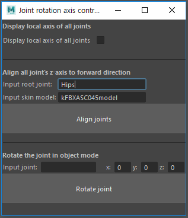

# alignJointAxes
In general, the fullbody animation data operates assuming that the z-axis of all joints in the T-pose is a forward vector.   
So, it is necesasry to align the z-axis of all joints in the forward direction.   
This code is for Maya.

> ### How to implement the code
> 1. Open "alignJointAxisZForward.py" in Script Editor
> 2. Ctrl+Enter for executing the code

> ### How to use the GUI
> 
> * #### Display local axis of joints
>   * Checkbox=True: Displaying / False: No displaying
> * #### Aligning the z-axis of all joints
>   * Create a new skeleton by copying the joints according to the hirarchy of the original skeleton.
>   * Then, apply the position value of the copied skeleton to the original skeleton and set the rotation value of the original skeleton to all 0
>   * Input
>     * <b>Root joint</b> of target skeleton
>     * <b>Skin model</b> applied to the target skeleton   
>  ※ You can drag and drop the joint object or skin model into each text field, but you should delete the path in the case of joint object.   
>     e.g.) |Hips (X) → Hips (O)
>   * Click the "Align joints" button, then you can see that the z-axis of all joints are aligned in forward direction.
>  * #### Rotating the joint in object mode
>    * In object mode, you can rotate the joint without modifying the mesh and any other joints(e.g. child joints)
>    * Input
>      * <b>Joint</b> that you want to rotate
>      ※ You can drag and drop the joint object even if there is a path in the name.   
>      e.g.) |Hips|Spine (O)
>      * <b>x, y, z rotation value</b> how much you want to rotate the joint
>    * Click the "Rotate joint" button, then you can see that the selected joint only rotates according to values of rotation without modifying other things.
